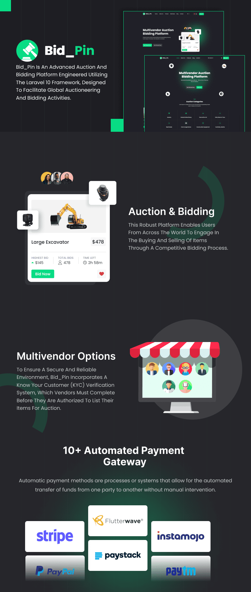

# Bid_Pin - Platform Lelang dan Penawaran Multivendor

 

Bid_Pin adalah platform lelang dan penawaran canggih yang dibangun menggunakan framework Laravel 10, dirancang untuk memfasilitasi kegiatan lelang dan penawaran global. Platform tangguh ini memungkinkan pengguna dari seluruh dunia untuk terlibat dalam proses jual beli barang melalui proses penawaran yang kompetitif. Untuk memastikan lingkungan yang aman dan dapat diandalkan, Bid_Pin menggabungkan sistem verifikasi Kenali Pelanggan Anda (KYC), yang harus diselesaikan oleh para vendor sebelum mereka diotorisasi untuk mencantumkan barang-barang mereka untuk dilelang. Hal ini memastikan bahwa semua transaksi dilakukan dengan transparansi dan integritas.

 

## Akses Demo:
- Demo: [https://preview.wstacks.com/bid_pin](https://preview.wstacks.com/bid_pin)
- Pengguna: [https://preview.wstacks.com/bid_pin/user/login](https://preview.wstacks.com/bid_pin/user/login)
  - Username: testuser | Password: 123456
- Admin: [https://preview.wstacks.com/bid_pin/admin](https://preview.wstacks.com/bid_pin/admin)
  - Username: admin | Password: admin

## Fitur Utama
- Template Frontend dan Backend yang Menarik
- Dukungan untuk Semua Browser dan Perangkat
- Multi-bahasa
- Pengaturan Global
- SEO, Recaptcha & Obrolan Langsung
- 10+ Gerbang Pembayaran
- Pengaturan Email
- Templat Email dan SMS
- Kebijakan Cookie GDPR
- Halaman Kebijakan Privasi
- Dukungan Cepat
- Dokumentasi Mudah

## Fitur Admin
- Manajemen Lelang dan Penawaran
- Manajemen Pemenang
- Manajemen Kategori
- Manajemen Pengguna
- Manajemen KYC
- Manajemen Setoran dan Penarikan
- Halaman
- Isi Halaman
- Pengaturan Global
- Pelanggan Langganan
- Pengaturan Logo
- Obrolan Langsung
- SEO
- Recaptcha
- Gerbang SMS
- Gerbang Pembayaran
- Pengaturan Email
- Kebijakan Cookie GDPR

## Fitur Pengguna
- Manajemen Lelang dan Penawaran
- Verifikasi KYC
- Riwayat Penawaran dan Kemenangan
- Dompet
- Penarikan
- Pengaturan Profil dan Keamanan

## Teknologi yang Digunakan
Dibangun dengan teknologi yang anti ketinggalan.
- Laravel 10
- Bootstrap 5.x
- jQuery 3.7.1
Termasuk dengan skrip
- Kode Sumber Lengkap
- Dokumentasi
- Basis Data

**Catatan:** Pastikan untuk membaca dokumentasi sebelum memulai penggunaan platform ini. Jika Anda memerlukan bantuan tambahan, jangan ragu untuk menghubungi kami. 
